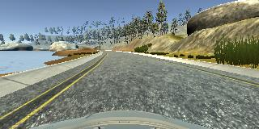
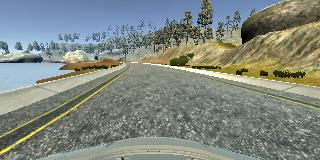
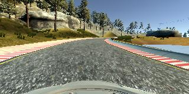

###Behavioral Cloning Project

For this project I mainly used "guess and check" because of my relative lack of theoretical
knowledge. I tried many different approaches for the problems below, some of which I will
talk about (there are too many to discuss all of the failed attempts).

##Data Collection

 I started by just driving around both tracks many times. I wasn't very good
at driving the simulated car at first, which meant that I occasionally crashed and often 
weaved too much on the road. I have only a macbook with keyboard input to actually do the 
recording. Near the beginning, every time I crashed I would have to manually remove the 
lines where I crashed from the csv, which was tedious. 

Later on, when my models weren't performing well on certain sections of the track, I 
trained specifically on those sections to improve how well I drove on them.

Here are some example images for turning right and left and driving straight:

Straight: 

Left turn:

Right turn:

##Preprocessing

I tried two different preprocessing measures for this problem: featurewise standard deviation
normalization and centering and also samplewise. I found that samplewise was slightly more
affective on validation data, so I ended up using it. To preserve memory, I only fitted
it on a random sample of 2,000 of my images. I also made copies of all of my images where
the image was flipped left to right and the corresponding angle multiplied by -1, so that 
I could get a good balance of left and right turns. 

##Model Architecture

The model architecture step was the longest part of the process for me. I started with a
very barebones network, consisting of a 2x2 convolution with followed by Maxpooling, Dropout,
a Flatten Layer, and finally a Dense layer. I noticed that RELU activations often died, 
leaving the same output for every input, and I fixed this by using LeakyReLU. From there, 
I tweaked my architecture to achieve better validation accuracy. This eventually led me to
the architecture I have now:

8x8 convolution with 32 filters

4x4 Max Pooling

4x4 convolution with 64 filters

3x3 Max Pooling

2x2 convolution with 128 filters

2x2 Max Pooling

LeakyReLU activation

Dropout (0.5)

Flatten

Dense with 128 neurons

LeakyReLU activation

Dense with 1 neuron

I have little theoretical knowledge about neural networks, but I did notice that the 
filter sizes tended to halve and the number of filters to double at each layer. I also
noticed that each new layer brought less and less improvement in loss, until finally the loss
began to increase.

##Evaluation

I tried to use a validation set as much as I could. Because I felt it was the best data
I had, I used the Udacity sample data as my validation set (I did, however, also use it 
for training when actually testing on the track). I designed my architecture and 
preprocessing steps using only validation accuracy; however, other decisions had to be 
made with actual track results, which may have led to overfitting.

I needed to test on the track for two main reasons. First, in the beginning I wasn't sure
which loss metric to use. This is impossible to test on the validation accuracy because there
is no way for me to measure which metric is better if I don't have a metric to compare metrics.
In the end, I used mean squared error as my loss metric. The second reason I needed to test
was after I had already optimized the network for the validation data. At this point, there
was nothing more that I could do aside from testing on the track. Many times, the testing
failed on certain parts, leading me to need to train on those sections more. When I did,
sometimes the new data would also lead the network architecture to change based on the new 
validation loss.

##Challenges

The "parking lot" area after the bridge took me a few weeks to figure out. The car would
usually just drive right into it, not realizing it wasn't a continuation of the road. I ended
up fixing it with lots and lots of training, but even now it barely makes it. If I had more
time I would love to make the turn more smooth, but unfortunately I do not. 

